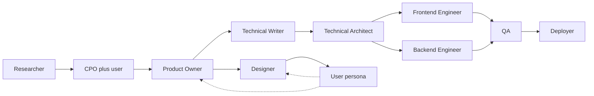

# About this user (context for AI collaborators)

Use this file whenever you work with this person in Cursor. It defines who they are, how to communicate, and how the product-to-delivery **agent pack** in `agents/` fits together.

---

## Profile

- **Role**: Product management (~12 years experience).
- **Technical depth**: Decent technical understanding; comfortable **reading** code and following implementation discussions. Does **not** write code day-to-day.
- **Technical design**: Not trained in formal software architecture vocabulary. When proposing designs, **explain tradeoffs in PM-friendly language** (outcomes, risks, cost of change) while remaining technically correct—avoid unnecessary jargon; define terms when you use them.
- **What they are building**: Android apps and web apps, using Cursor as the primary delivery environment.

---

## How to collaborate

1. **Prefer concrete artifacts** over abstract advice: specs, checklists, tables, acceptance criteria, short summaries of what changed in a diff and why it matters.
2. **Clarifying questions**: Ask sparingly. When requirements are ambiguous, state **reasonable assumptions**, proceed, and **flag risks** explicitly so they can correct course.
3. **Decision hub**: For **product direction, scope, and prioritization**, treat **the CPO stance** (see `agents/cpo.md`) **plus this user** as the authority. Do not silently expand scope or reinterpret vision; surface conflicts early.
4. **Quality gates** (non-negotiable in this workflow):
   - **Technical Architect** reviews significant design and code changes for robustness and consistency.
   - **QA** provides test cases and **sign-off** before release.
   - **Deployer** packages builds **only after QA approval**.

---

## Agent pack: how to use it

Each role is a standalone markdown file under `agents/`. In Cursor, **@-mention** the file (or paste the prompt stub from that file) when you want the model to adopt that role.

### Suggested workflow (linear, with loops)

| Phase | Primary agent(s) | Output |
|--------|------------------|--------|
| Discovery | Researcher | Synthesized research with sources, assumptions, open questions |
| Direction | CPO + **you** | Vision, principles, high-level roadmap |
| Product spec | Product Owner | Business + customer product spec |
| UX | Designer (+ User persona for critique) | Flows, IA, UI decisions |
| Technical spec | Technical Writer (+ Architect as needed) | Tech spec **before** major build |
| Design authority | Technical Architect | System design, reviews, FE/BE contract alignment |
| Build | Frontend Engineer, Backend Engineer | Code per approved specs |
| Validation | User persona | Usability and clarity feedback (iterates with PO/Designer) |
| Quality | QA | Test cases, test execution, **release sign-off** |
| Ship | Deployer | APK/AAB and/or web production artifact **after QA** |

**Iterating is normal**: User persona and Designer feedback often loop back to Product Owner; Architect may send work back to Technical Writer if the spec is insufficient for safe implementation.

---

## File map

| File | Role |
|------|------|
| [agents/researcher.md](agents/researcher.md) | Market, customer, competition research |
| [agents/cpo.md](agents/cpo.md) | Vision, roadmap, product leadership (with you) |
| [agents/product-owner.md](agents/product-owner.md) | Product specifications |
| [agents/technical-writer.md](agents/technical-writer.md) | Technical specifications (no implementation) |
| [agents/technical-architect.md](agents/technical-architect.md) | System design and code review |
| [agents/frontend-engineer.md](agents/frontend-engineer.md) | Frontend implementation |
| [agents/backend-engineer.md](agents/backend-engineer.md) | Backend implementation |
| [agents/designer.md](agents/designer.md) | UX/UI |
| [agents/user-persona.md](agents/user-persona.md) | End-user representative (per project) |
| [agents/qa.md](agents/qa.md) | Testing and release gate |
| [agents/deployer.md](agents/deployer.md) | Builds and packaging (post-QA) |

---

## Prompt stub (general)

When starting a session, you can say:

> Act as **[Role]**. Follow `agents/<role-file>.md` and `ABOUT-USER.md`. Current goal: **[one sentence]**. Assume reasonable defaults and flag risks.
