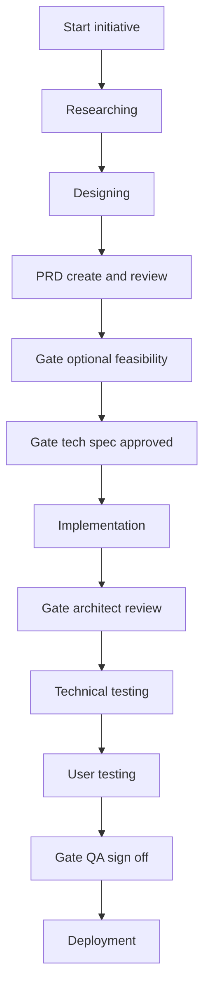

# Product delivery procedure (SOP)

This is the **canonical procedure** for taking work from discovery to release in Cursor: **researching → designing → PRD (create + review) → development → technical testing → user testing → deployment**.

It aligns with [ABOUT-USER.md](../ABOUT-USER.md) ( **CPO stance + you** as the product decision hub) and the agent pack under [agents/](../agents/). In chats, **@-mention** the listed agent files when operating that phase.

**Terminology**: In this SOP, **PRD** means the **Product Owner–owned product specification** (the “what” and “why”). The **technical specification** (the “how” at an engineering level, no production code) is produced by the Technical Writer role and approved by the Technical Architect before heavy build-out.

---

## How to use this SOP

| Mode | When |
|------|------|
| **Full path** | New initiative, new surface, or material risk (data, money, compliance, auth). |
| **Thin path** | Tiny change (copy, styling, bugfix) with no behavior or policy change: skip or shorten research/design/PRD; still use **Architect** judgment for risk, **QA** for release, **Deployer** after QA. |

**Where to store artifacts** (recommendation, not a hard rule):

- PRD and research: `docs/` or `specs/` in the project repo.
- Technical spec: same place, clearly named (e.g. `specs/TECH-<feature>.md`).
- Test plans and release notes: `docs/releases/` or next to the PRD.

**Global gates** (from [ABOUT-USER.md](../ABOUT-USER.md)):

1. **Technical Architect** reviews significant design and code for robustness and consistency.
2. **QA** provides test coverage and **explicit sign-off** before release.
3. **Deployer** produces APK/AAB and/or web builds **only after** QA approval.

---

## End-to-end flow (phases and gates)



**Note**: “Development” in this SOP is **4a technical spec** (approved at **specGate**) then **4b implementation** (reviewed at **archGate**). **qaGate** is the final release approval before **Deployer** acts.

---

## Phase 1 — Researching

| | |
|--|--|
| **Purpose** | Build an evidence-backed view of market, customers, and competition so decisions are not guesswork. |
| **Primary agent** | [@agents/researcher.md](../agents/researcher.md) |
| **Decision partners** | **CPO stance + you** — translate “findings” into “what we believe” and “what we do next.” |

**Inputs**

- Problem space, geography, business model (if known).
- Any links, notes, or data you already have.

**Outputs**

- Research brief: sources listed, facts vs inference separated, assumptions, open questions, recommendations.

**Exit criteria**

- [ ] Source list with dates (and URLs where applicable).
- [ ] Explicit assumptions and what would falsify them.
- [ ] Implications for product captured (hypotheses, not silent scope).

**Checklist**

- [ ] @-mention `agents/researcher.md` (and `ABOUT-USER.md` if useful).
- [ ] Sync implications with **CPO + you** before locking direction in design/PRD.

---

## Phase 2 — Designing

| | |
|--|--|
| **Purpose** | Turn goals into flows, structure, states, and copy direction so the PRD and build are not invented at the keyboard. |
| **Primary agents** | [@agents/designer.md](../agents/designer.md); [@agents/user-persona.md](../agents/user-persona.md) for critique |
| **Decision partners** | **CPO + you** for major UX that changes scope or strategy. |

**Inputs**

- Research brief (phase 1).
- Strategic direction from **CPO + you**.

**Outputs**

- UX flows (steps), information architecture, UI structure, loading/empty/error states, key microcopy.
- Open UX questions explicitly listed for the PRD.

**Exit criteria**

- [ ] Happy path and primary edge states addressed in design narrative.
- [ ] User persona feedback incorporated or deferred with rationale.

**Checklist**

- [ ] Fill or paste the **Persona block** in `agents/user-persona.md` for this project.
- [ ] @-mention `agents/designer.md` and `agents/user-persona.md` for iterations.

---

## Phase 3 — PRD creating and review

| | |
|--|--|
| **Purpose** | Single source of truth for **what** ships: customer and business perspective, testable acceptance criteria. |
| **Authoring agent** | [@agents/product-owner.md](../agents/product-owner.md) |
| **Approval** | **CPO stance + you** (no major ambiguity left implicit). |
| **Optional** | [@agents/technical-architect.md](../agents/technical-architect.md) for a **feasibility / risk** pass (not a substitute for the full technical spec). |

**Inputs**

- Research brief; design outputs; vision/roadmap from **CPO + you**.

**Outputs**

- PRD document (see **Template A — PRD outline** below).
- Version id: date or `v0.x` in the doc title/footer.

**Exit criteria**

- [ ] Goals, non-goals, and acceptance criteria are testable.
- [ ] **CPO + you** approval recorded (short note in doc or chat log).
- [ ] Open questions either resolved or tagged as “post-MVP / spike.”

**Checklist**

- [ ] @-mention `agents/product-owner.md` for drafting; `agents/cpo.md` for review alignment.
- [ ] Traceability: each major requirement has an id (e.g. `REQ-01`) for QA later.

---

## Phase 4 — Development

This phase includes **technical specification** and **implementation**. Do **not** skip the spec for non-trivial work.

### 4a — Technical specification (prerequisite)

| | |
|--|--|
| **Purpose** | Define behavior, contracts, data, errors, security, and observability **without** writing production code as the spec. |
| **Primary agent** | [@agents/technical-writer.md](../agents/technical-writer.md) |
| **Approver** | [@agents/technical-architect.md](../agents/technical-architect.md) |

**Exit criteria**

- [ ] Technical spec approved by Architect (or documented waiver for trivial change).
- [ ] FE/BE contracts clear enough that engineers do not guess.

### 4b — Implementation

| | |
|--|--|
| **Purpose** | Ship code against PRD + technical spec. |
| **Primary agents** | [@agents/frontend-engineer.md](../agents/frontend-engineer.md); [@agents/backend-engineer.md](../agents/backend-engineer.md) |
| **Review** | [@agents/technical-architect.md](../agents/technical-architect.md) for significant changes |

**Exit criteria**

- [ ] Acceptance criteria from PRD satisfied or gaps explicitly filed as follow-ups.
- [ ] Architect review complete per team bar (see agent file).
- [ ] Short “what changed / how to verify” note for QA.

**Checklist**

- [ ] @-mention engineer agent(s) + `agents/technical-architect.md` for reviews.
- [ ] If behavior drifts from spec, update spec or record a decision — do not silently diverge.

---

## Phase 5 — Technical testing

| | |
|--|--|
| **Purpose** | Verify correctness, regression safety, integrations, and platform behavior (Android + web as applicable). |
| **Primary agent** | [@agents/qa.md](../agents/qa.md) |

**Inputs**

- PRD acceptance criteria; technical spec; engineer handoff notes.

**Outputs**

- Test plan and cases (see **Template B — Test plan skeleton**); defect list; **technical** pass/fail view.

**Exit criteria**

- [ ] Critical and high defects resolved or **explicitly waived** by **CPO + you** with risk note.
- [ ] Regression scope documented for this change.

**Checklist**

- [ ] @-mention `agents/qa.md`.
- [ ] Map tests to requirement ids from the PRD where possible.

---

## Phase 6 — User testing

| | |
|--|--|
| **Purpose** | Validate **task success**, comprehension, and trust — not only that AC strings pass. |
| **Primary agents** | [@agents/user-persona.md](../agents/user-persona.md); [@agents/designer.md](../agents/designer.md) and [@agents/product-owner.md](../agents/product-owner.md) for fixes; [@agents/qa.md](../agents/qa.md) for UAT script / charter if desired |

**Inputs**

- Build candidate; PRD scenarios; design intent.

**Outputs**

- User testing summary: **must-fix** vs **defer**; quotes or observations; recommendations.

**Exit criteria**

- [ ] Must-fix items closed or promoted to tracked exceptions with **CPO + you** approval.
- [ ] PRD/design updated if discoveries change requirements.

**Checklist**

- [ ] Run after technical testing narrows gross defects (avoid wasting user cycles on broken builds).
- [ ] @-mention `agents/user-persona.md` with the active Persona block filled in.

---

## Phase 7 — Deployment

| | |
|--|--|
| **Purpose** | Produce installable/shareable artifacts: **APK/AAB** and/or **web** production build. |
| **Primary agent** | [@agents/deployer.md](../agents/deployer.md) |
| **Hard gate** | **QA sign-off** from phase 5 (and user-testing exceptions handled per phase 6). |

**Inputs**

- QA sign-off wording; known issues list; repo state (branch/commit).

**Outputs**

- Artifacts; reproducible build steps; install/run instructions (see **Template C — Release handoff note**).

**Exit criteria**

- [ ] QA explicit approval on record.
- [ ] No secrets committed or pasted into docs; use secure channels for keys.

**Checklist**

- [ ] @-mention `agents/deployer.md` only after `agents/qa.md` sign-off.
- [ ] Version/build identity recorded for traceability.

---

## Loops and rework (normal)

- User testing may send work back to **Design** or **PRD** (minor) or **Development** (bugs).
- Technical testing may block user testing until stability is acceptable.
- **CPO + you** remain the escalation point when scope, dates, or risk acceptance conflict.

---

## Cross-artifact model change (e.g. nutrition, scoring, eligibility)

Use this when a **user-visible “model”** changes: how something is calculated, what inputs mean, what targets apply, or what data downstream features need. Example: shifting Today from food groups to **macro-anchored** estimates and gap-driven meal ideas.

**Update order (dependency order — avoids contradictions)**

1. **Research / knowledge base** — Ranges, sources, disclaimers, localization (what is illustrative vs clinical). Cite links and version assumptions.
2. **PRD** — Lock: **inputs** → **rollup or calculation rules** → **reference targets / thresholds** → **edge cases** → **FRs, ACs, analytics**. Bump doc version; note honest-imprecision copy where numbers appear.
3. **Milestone or product spec + app context** — Short outcome, IA, stories so stakeholders are not forced to read only the PRD.
4. **Hi-fi design spec** — Screens, new components, copy deck IDs, open issues for PO/Architect.
5. **Prototype + prompt** — Static HTML (or equivalent) matches design; **`PROTOTYPE-NOTES.md`** records deliberate omissions (e.g. alternate age-band page not built).

**Before locking UI, answer (in the PRD)**

| Question | Why it matters |
|----------|----------------|
| Where do **targets** or **rules** come from? | Age band, locale, versioned defaults — avoids false precision. |
| What do **user inputs** produce? | Deterministic rollup from explicit primitives; no undocumented magic. |
| What must **content or catalog** include? | e.g. recipes with macro fields for suggestions; behavior when fields are missing. |

**Quality pass after the doc bundle changes**

- Run **BMad Adversarial Review** and **Edge Case Hunter** on the updated PRD + design (fresh context per skill).
- Save findings **next to product docs** (e.g. `*-bmad-review-*.md` / `.json`) and **link from the PRD references** so the next iteration does not re-litigate the same gaps.

**Checklist**

- [ ] KB (or equivalent research artifact) updated and linked from PRD where numbers or bands appear.
- [ ] PRD §model / §business rules + ACs + analytics aligned; version/changelog entry.
- [ ] Milestone/context and design spec updated in the same pass.
- [ ] Prototype + master prompt + prototype notes reflect the same story.
- [ ] AR + ECH artifacts produced and referenced from PRD.

---

## Template A — PRD outline

Copy into `docs/` or `specs/` and fill in.

```markdown
# PRD: <product or feature name>
**Version:** <date or v0.x>  **Owner:** <you>  **Status:** Draft | In review | Approved

## 1. Summary
- One paragraph: who, problem, proposed solution.

## 2. Goals and non-goals
- Goals:
- Non-goals:

## 3. Context
- Research links / brief summary.
- Related roadmap theme (CPO alignment).

## 4. Target users and personas
- Primary:
- Secondary:

## 5. User journeys and scenarios
- Journey 1 (happy path):
- Edge cases:

## 6. Functional requirements
| ID | Requirement | Priority (Must / Should / Could) |
|----|----------------|-----------------------------------|
| REQ-01 | | |

## 7. Business rules and policies
- Pricing, eligibility, compliance, admin rules (product language).

## 8. Acceptance criteria
- Per epic/feature: Given / When / Then or checklist tied to REQ ids.

## 9. Analytics and success metrics
- Events, funnel, leading indicators.

## 10. Dependencies and risks
- Other teams, legal, platform, technical spikes.

## 11. Open questions
- Question | Owner | Due / resolution

## 12. Approval
- CPO + PM approval: <name, date>
```

---

## Template B — Test plan skeleton

```markdown
# Test plan: <release or feature>
**Build / commit:**  **Tester:**  **Date:**

## 1. Scope
- In scope:
- Out of scope:

## 2. References
- PRD version:
- Technical spec version:

## 3. Environments
- Web: browsers / URLs
- Android: devices / OS versions

## 4. Traceability (stub)
| REQ ID | Test case ids | Automated (Y/N) |
|--------|----------------|-----------------|
| REQ-01 | TC-01, TC-02 | |

## 5. Test cases
### TC-01 <title>
- Preconditions:
- Steps:
- Expected:
- Result: Pass / Fail (notes)

## 6. Exploratory charters
- Charter 1: <mission> <timebox> <focus areas>

## 7. Defect summary
| ID | Severity | Description | Status |

## 8. Release recommendation
- Pass / Pass with exceptions / No-go
- **QA sign-off:** <one explicit sentence for Deployer>
```

---

## Template C — Release handoff note

```markdown
# Release handoff: <product> <version>
**Date:**  **Requested by:** <you>

## 1. Source
- Branch:
- Commit SHA:
- QA sign-off: (paste from QA)

## 2. Build
- Commands / CI job:
- Variant (Android): debug / release / flavor

## 3. Artifacts
- Android: <path or CI artifact name> (APK/AAB)
- Web: <output dir or hosting target>

## 4. Install / run (for PM)
- Android steps:
- Web URL / login:

## 5. Configuration
- Environment variables (names only; no secret values):
- Feature flags:

## 6. Known issues
- (Copy from QA / user testing)

## 7. Rollback
- How to revert or previous stable version:
```

---

## Quick @-mention index

| Phase | Agent files |
|-------|-------------|
| Researching | `agents/researcher.md`, `agents/cpo.md` |
| Designing | `agents/designer.md`, `agents/user-persona.md` |
| PRD | `agents/product-owner.md`, `agents/cpo.md`, optional `agents/technical-architect.md` |
| Development | `agents/technical-writer.md`, `agents/technical-architect.md`, `agents/frontend-engineer.md`, `agents/backend-engineer.md` |
| Technical testing | `agents/qa.md` |
| User testing | `agents/user-persona.md`, `agents/designer.md`, `agents/product-owner.md`, `agents/qa.md` |
| Deployment | `agents/deployer.md` (after `agents/qa.md`) |

Always include [ABOUT-USER.md](../ABOUT-USER.md) when you want session-wide behavior defaults.
